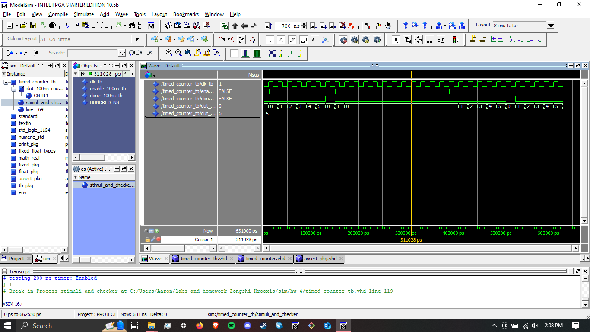

# Homework 4: timed counter

## Overview
In this assignment, I created and tested a "timed counter" component. this couter counted for a specified time, then asserted a done signal when the specified time had elapsed.

## Deliverables

