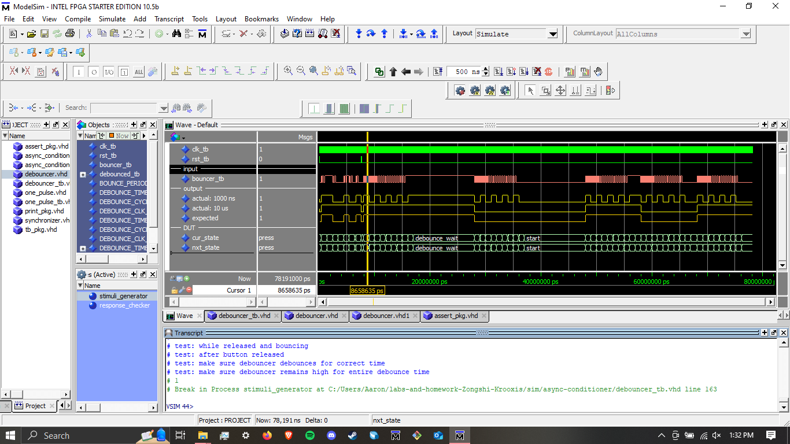
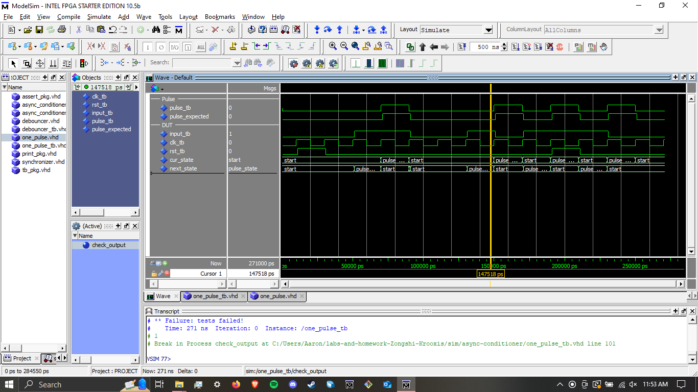

# Homework 6: Async Conditioner `~/sim/async-conditioner/` and `~/hdl/async-conditioner`)

## Overview
When external signals are used with FPGAs, such as a signal coming from a pushbutton, they need to be conditioned before the input signals are used. For this homework, I created a hierarchical design that implements a synchronizer a debouncer, and a one pulse linked in sequence to condition a simulated pushbutton. I had trouble with the test bench code. My expected output did not line up with the rising edge of clk_tb and was off by less than or equal to a cycle. I think if I used the wait_for_clock_edge procedure I may have had more accurate results.

## Deliverables

